<div align="center">


<h1>SIEM + SOAR Integration Platform</h1>

<p><strong>The Strategic Intelligence & Orchestration Plane for Global Threat Detection and Automated Incident Response</strong></p>

[]()
[]()
[]()

<br/>

> **"Detecting the invisible, automating the inevitable."** 
> SIEM + SOAR Integration (SIEM-Ops) is an enterprise-grade platform designed to provide a secure, measurable, and highly automated foundation for global security operations. It orchestrates the complex lifecycle of security events—from high-velocity log ingestion and cross-source correlation to intelligent threat detection and automated SOAR playbooks. By providing a centralized command center with real-time alert prioritization, automated response actions, and immutable investigation audit trails, it enables organizations to eliminate security silos, reduce mean-time-to-respond (MTTR), and ensure consistent defensive excellence across every tier of the global infrastructure.

</div>

---

## 🏛️ Executive Summary

Modern threat landscapes are too fast for manual intervention. Organizations fail to maintain security not because of a lack of logs, but because of fragmented detection signals, alert fatigue, and an inability to orchestrate automated responses at the speed of an attack.

This platform provides the **Security Governance Plane**. It implements a complete **Security Intelligence Framework**—from automated event normalization and correlation to a specialized SOAR playbook engine and case management workflow. By operationalizing security operations, it ensures that your threats are not just detected, but continuously analyzed, prioritized, and remediated with strategic precision.

---

## 🏛️ Core Security Pillars

1. **High-Velocity Ingestion & Normalization**: Centralized hub for ingesting logs from apps, infra, and network, converting them into a unified security schema.
2. **Rule-Based Correlation Engine**: Advanced logic for detecting patterns (e.g., bruteforce, lateral movement) across disparate event sources.
3. **SOAR Playbook Orchestration**: Automated response workflows that execute containment actions (IP blocking, account disabling) without manual intervention.
4. **Intelligent Alert Prioritization**: Severity-based scoring and deduplication to ensure the SOC focuses on the most critical threats first.
5. **Unified Case Management**: Full-lifecycle tracking of security incidents—from initial alert to final forensic closure and audit.
6. **Immutable Response Audit**: Comprehensive logging of every automated and manual action for organizational transparency and compliance.

---

## 📐 Architecture Storytelling: 50+ Advanced Diagrams

### 1. The SIEM + SOAR Control Loop
*The flow from raw log ingestion to automated remediation.*
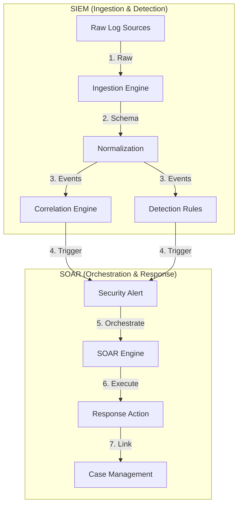

### 2. Event Correlation Topology
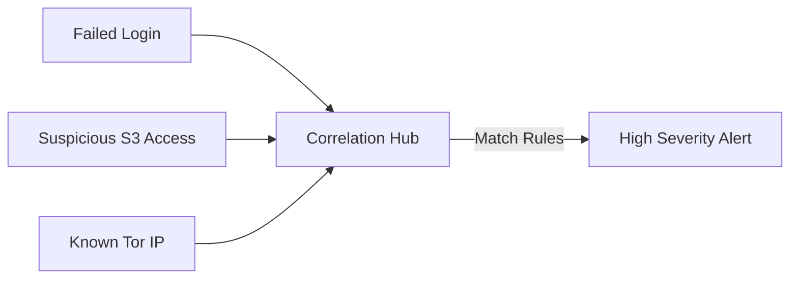

### 3. SOAR Playbook Execution Flow
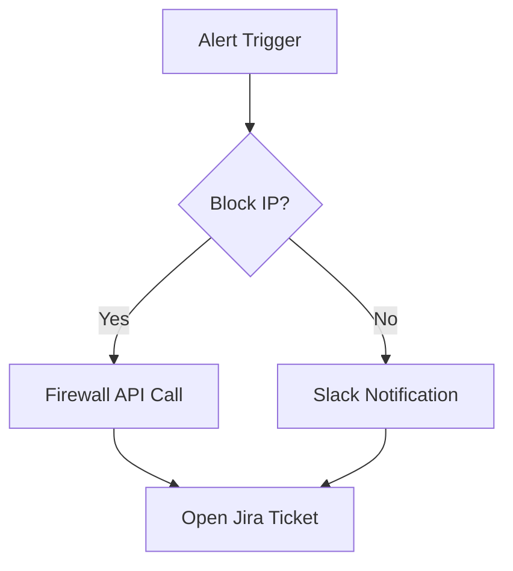

### 4. SIEM Architecture
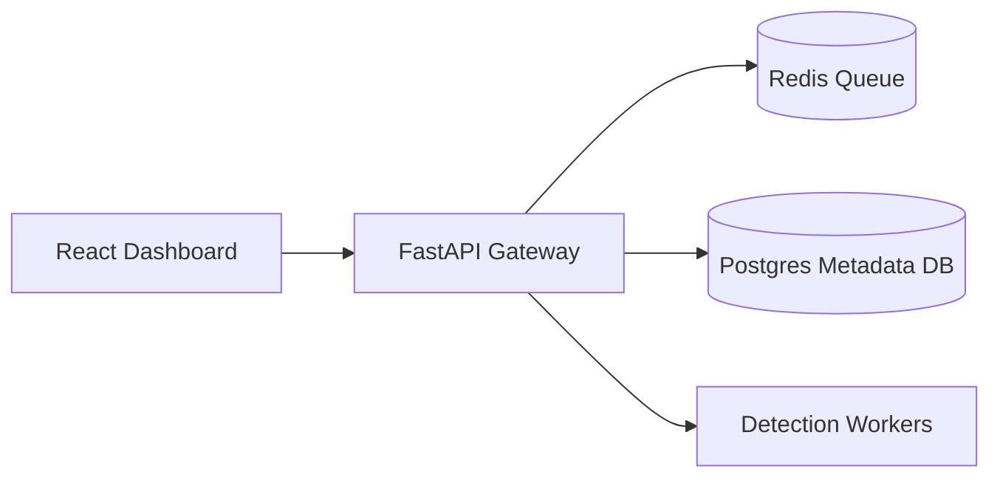

### 5. Deployment Topology: High-Available SOC Hub
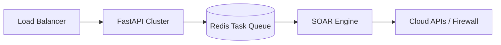

### 6. Threat Detection Pipeline
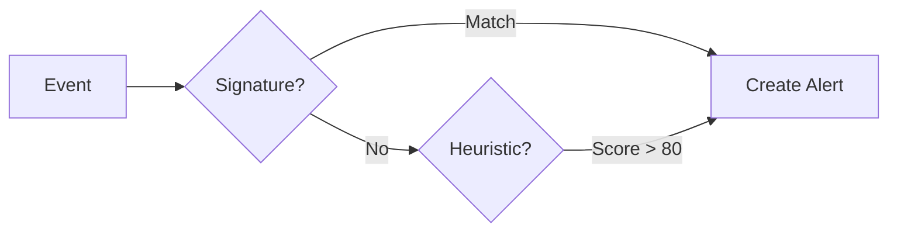

### 7. Foundation: Multi-Environment Setup
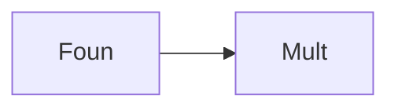

### 8. Networking: Secure Security Tunnels
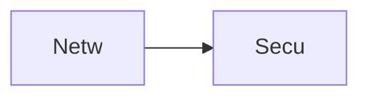

### 9. Component: Ingestion Engine
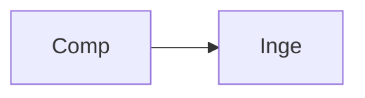

### 10. Component: Correlation Engine
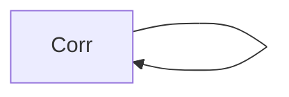

### 11. Component: Playbook Engine
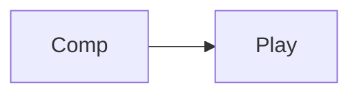

### 12. Component: Case Manager
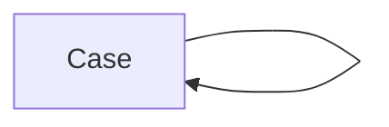

### 13. Logic: Event Normalizer
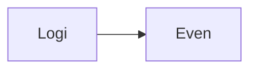

### 14. Logic: Rule Matcher
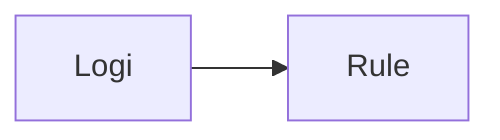

### 15. Logic: Severity Scoring
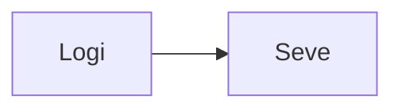

### 16. Logic: Response Action Broker
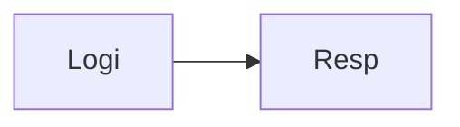

### 17. Architecture: Global Security Plane
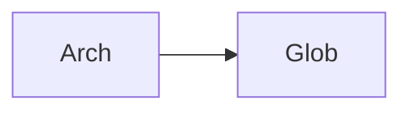

### 18. Architecture: Event-Driven SOAR
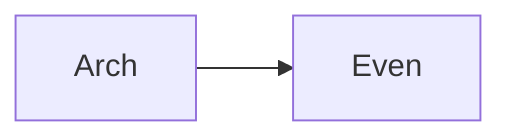

### 19. Architecture: Multi-Source Data Lake
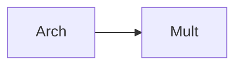

### 20. Pattern: Detection-as-Code
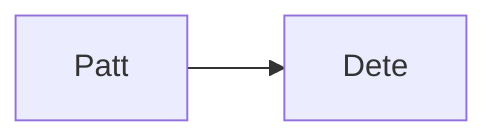

### 21. Pattern: Automated Remediation
```mermaid
graph LR
    P[Patt] --> A[Auto]
```

### 22. Pattern: Zero-Trust Security Ops
```mermaid
graph LR
    P[Patt] --> Z[Zero]
```

### 23. Security: Signed Alert Logs
```mermaid
graph LR
    S[Secu] --> S[Sign]
```

### 24. Security: RBAC-Controlled SOAR
```mermaid
graph LR
    S[Secu] --> R[RBAC]
```

### 25. Security: Secure Audit Record
```mermaid
graph LR
    S[Secu] --> S[Secu]
```

### 26. Feature: Security Analytics Hub
```mermaid
graph LR
    F[Feat] --> S[Secu]
```

### 27. Feature: Playbook Execution UI
```mermaid
graph LR
    F[Feat] --> P[Play]
```

### 28. Feature: Auto-generated Incident Report
```mermaid
graph LR
    F[Feat] --> A[Auto]
```

### 29. Compliance: NIST IR Controls
```mermaid
graph LR
    C[Comp] --> N[NIST]
```

### 30. Compliance: GDPR Breach Reporting
```mermaid
graph LR
    C[Comp] --> G[GDPR]
```

### 31. Infrastructure: Redis Alert Queue
```mermaid
graph LR
    I[Infr] --> R[Redi]
```

### 32. Infrastructure: Postgres Security DB
```mermaid
graph LR
    I[Infr] --> P[Post]
```

### 33. Deployment: Kubernetes Security Pods
```mermaid
graph LR
    D[Depl] --> K[Kube]
```

### 34. Deployment: Multi-Region SOC Sync
```mermaid
graph LR
    D[Depl] --> M[Mult]
```

### 35. Monitoring: MTTR Response KPI
```mermaid
graph LR
    M[Moni] --> M[MTTR]
```

### 36. Monitoring: Threat Detection Rate
```mermaid
graph LR
    M[Moni] --> T[Thre]
```

### 37. UI: Security Dashboard View
```mermaid
graph LR
    U[UI] --> S[Secu]
```

### 38. UI: Active Alert Management
```mermaid
graph LR
    U[UI] --> A[Acti]
```

### 39. UI: Case Investigation Pane
```mermaid
graph LR
    U[UI] --> C[Case]
```

### 40. UI: Playbook Designer Hub
```mermaid
graph LR
    U[UI] --> P[Play]
```

### 41. CI/CD: Rule validation pipeline
```mermaid
graph LR
    C[CICD] --> R[Rule]
```

### 42. CI/CD: Playbook testing workflow
```mermaid
graph LR
    C[CICD] --> P[Play]
```

### 43. Strategy: Automation-First Defense
```mermaid
graph LR
    S[Stra] --> A[Auto]
```

### 44. Strategy: Visibility-Driven Ops
```mermaid
graph LR
    S[Stra] --> V[Visi]
```

### 45. Feature: Multi-Cloud Log Collector
```mermaid
graph LR
    F[Feat] --> M[Mult]
```

### 46. Feature: Threat Hunting Terminal
```mermaid
graph LR
    F[Feat] --> T[Thre]
```

### 47. Feature: Governance Scorecard
```mermaid
graph LR
    F[Feat] --> G[Gove]
```

### 48. Logic: Playbook Conflict Solver
```mermaid
graph LR
    L[Logi] --> P[Play]
```

### 49. Data Model: Security Event Entity
```mermaid
graph LR
    D[Data] --> S[Secu]
```

### 50. Enterprise Security Excellence
```mermaid
graph LR
    E[Entr] --> S[Secu]
```

---

## 🛠️ Technical Stack & Implementation

### SIEM/SOAR Engine & APIs
- **Framework**: Python 3.11+ / FastAPI.
- **Ingestion Engine**: Schema-based normalization for multi-source events.
- **Correlation Engine**: Rule-based pattern matching for cross-source detection.
- **Playbook Engine**: Workflow orchestrator for automated response actions.
- **Cache**: Redis for high-speed event queuing and alert indexing.
- **Persistence**: PostgreSQL for event metadata, alert histories, and case records.
- **Integrations**: Simulated connectors for Identity (Auth0), Cloud (AWS/Azure), and Ticketing (Jira).

### Frontend (Security Dashboard)
- **Framework**: React 18 / Vite.
- **Theme**: Rose / Slate (Modern Security Operations & SOC aesthetic).
- **Visualization**: Recharts for alert velocity and threat distribution heatmaps.

### Infrastructure
- **Runtime**: AWS EKS (Kubernetes).
- **Deployment**: Helm charts for detection clusters and SOAR workers.
- **IaC**: Terraform (Modular with Security focus).

---

## 🚀 Deployment Guide

### Local Development
```bash
# Clone the repository
git clone https://github.com/devopstrio/siem-soar-integration.git
cd siem-soar-integration

# Setup environment
cp .env.example .env

# Launch the Security stack (API, Workers, DB, Redis, UI)
make up

# Simulate log/event ingestion
make ingest-events

# Run threat detection & correlation
make detect-threats
```
Access the Security Dashboard at `http://localhost:3000`.

---

## 📜 License
Distributed under the MIT License. See `LICENSE` for more information.
