<div align="center">


<h1>SIEM + SOAR Integration Platform</h1>

<p><strong>The Strategic Intelligence & Orchestration Plane for Global Threat Detection and Automated Incident Response.</strong></p>

[]()
[]()
[]()

<br/>

> **"Detecting the invisible, automating the inevitable."** 
> **SIEM + SOAR Integration (SIEM-Ops)** is an institutional-grade platform designed to provide a secure, measurable, and highly automated foundation for global security operations. It orchestrates the entire lifecycle—from high-velocity log ingestion and cross-source correlation to intelligent threat detection and automated SOAR playbooks.

</div>

---

## 🏛️ Executive Summary

Modern threat landscapes are too fast for manual intervention. Organizations often fail to maintain security not because of a lack of logs, but because of fragmented detection signals and alert fatigue that prevents timely response at the speed of an automated attack.

This platform provides the **Security Governance Plane**. It implements a complete **Security Intelligence Framework**, enabling SOC and Incident Response teams to manage threat lifecycles as a first-class citizen. By automating the normalization of events and the execution of containment playbooks, we ensure that organizational assets are continuously protected, governed, and remediated with strategic precision.

---

## 📐 Architecture Storytelling: Principal Reference Models

### 1. Principal Architecture: Global Cyber Defense & Automation Plane
This diagram illustrates the end-to-end flow from multi-cloud log ingestion and correlation to automated containment and forensic case management.

```mermaid
graph LR
    %% Subgraph Definitions
    subgraph IngestionPlane["Multi-Source Ingestion Hub"]
        direction TB
        CloudLogs["AWS CloudWatch / Azure Monitor"]
        OnPremLogs["Syslog / WinEvent / Firewall"]
        AppLogs["Application & Middleware Logs"]
    end

    subgraph DetectionIntelligence["SIEM Detection Intelligence"]
        direction TB
        API["FastAPI Security Gateway"]
        Normalizer["Event Normalization Engine"]
        Correlator["Cross-Source Correlation Engine"]
        Rules["Sigma / YARA Rule Registry"]
    end

    subgraph AutomationPlane["SOAR Orchestration Engine"]
        direction TB
        Playbooks["Incident Playbook Registry"]
        Executor["Automated Response Executor"]
        Enrichment["Threat Intel Enrichment (VT/AB)"]
    end

    subgraph CaseManagement["Institutional SOC Command"]
        direction TB
        Dash["SOC Command Dashboard"]
        Case["Incident Case Management"]
        Forensics["Forensic Metadata Lake"]
    end

    subgraph DevOps["Detection-as-Code Orchestration"]
        direction TB
        GH["GitHub Actions (Rule CI/CD)"]
        TF["Terraform SIEM Providers"]
        Policy["Security-as-Code Policies"]
    end

    %% Flow Arrows
    IngestionPlane -->|1. Raw Streams| Normalizer
    Normalizer -->|2. Schema Mapping| Correlator
    Correlator -->|3. Match Rules| Rules
    Rules -->|4. High Severity Alert| Executor
    
    Executor -->|5. Enrich Context| Enrichment
    Enrichment -->|6. Execute Response| Playbooks
    Playbooks -->|7. Contain Threat| IngestionPlane
    
    API -->|8. Visualize Alert| Dash
    Dash -->|9. Open Incident| Case
    Case -->|10. Archive Record| Forensics
    
    GH -->|11. Push Rules| Rules
    TF -->|12. Provision Ingest| IngestionPlane

    %% Styling
    classDef ingestion fill:#f5f5f5,stroke:#616161,stroke-width:2px;
    classDef detection fill:#ede7f6,stroke:#311b92,stroke-width:2px;
    classDef automation fill:#e3f2fd,stroke:#0d47a1,stroke-width:2px;
    classDef case fill:#fce4ec,stroke:#880e4f,stroke-width:2px;
    classDef devops fill:#fffde7,stroke:#f57f17,stroke-width:2px;

    class IngestionPlane ingestion;
    class DetectionIntelligence detection;
    class AutomationPlane automation;
    class CaseManagement case;
    class DevOps devops;
```

### 2. The Unified Threat Lifecycle: Detection to Recovery
The continuous path of managing a security incident from initial log generation to final forensic closure.

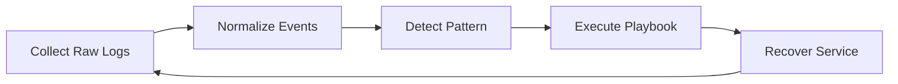

### 3. High-Velocity Log Ingestion Hub
Converting diverse and unstructured log streams into a unified, queryable security schema.

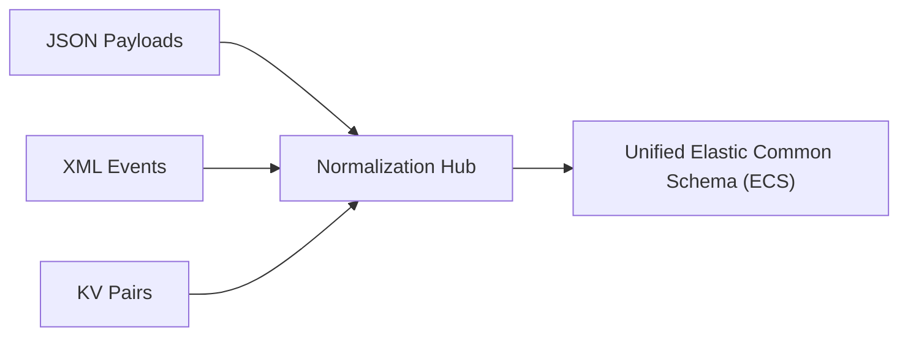

### 4. Detection-as-Code Pipeline
Treating detection rules like software, with version control, peer review, and automated deployment.

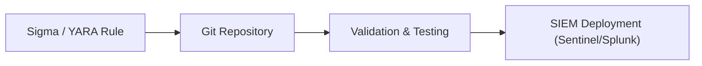

### 5. SOAR Playbook Execution Logic: Automated Remediation
The logic flow for responding to a critical security event without manual intervention.

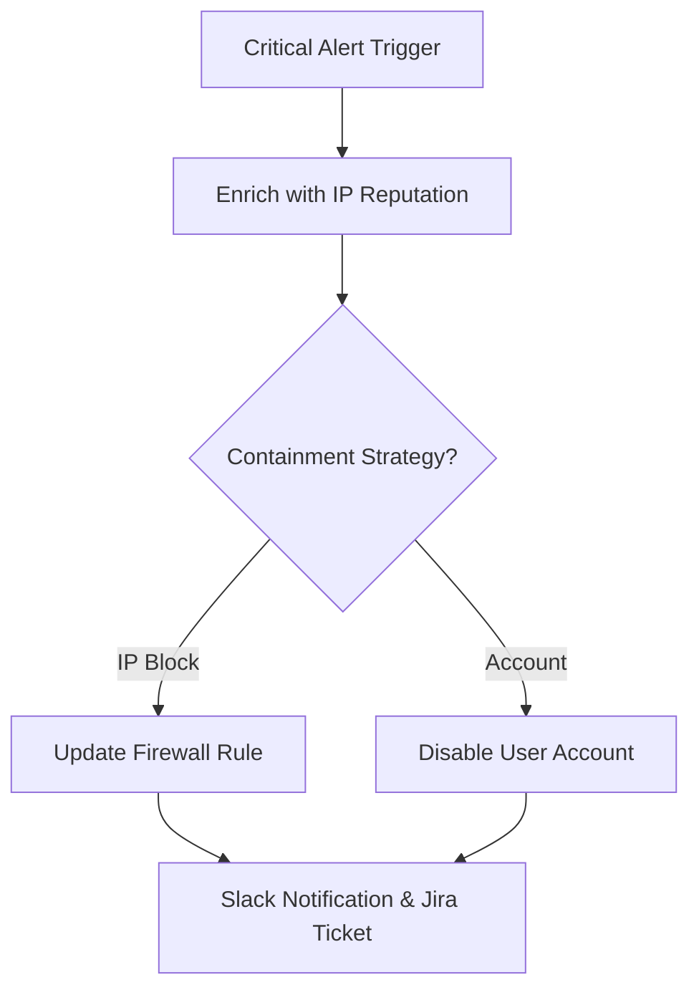

### 6. Incident Response Triage Matrix
Strategic prioritization of security alerts to optimize SOC analyst cognitive load.

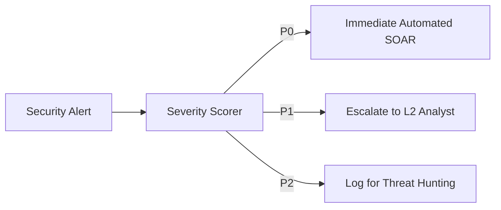

### 7. Multi-Cloud SOC Deployment Architecture
Ensuring consistent visibility across AWS, Azure, and GCP through a single pane of glass.

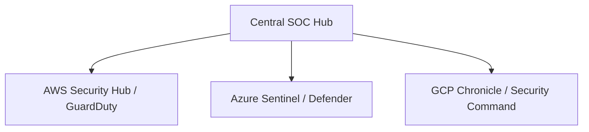

### 8. Identity & RBAC for Security Operations
Managing fine-grained access to sensitive security data and automated response tools.

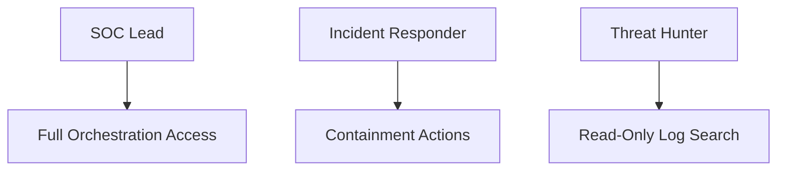

### 9. Institutional Compliance & Reporting
Generating NIST, GDPR, and SOC2 compliant records of security incidents and responses.

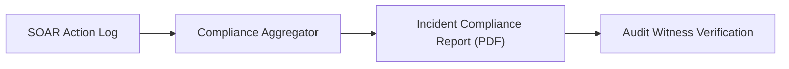

### 10. IaC Security Deployment: SIEM-as-Code
Using Terraform to manage the configuration and deployment of the entire SIEM/SOAR infrastructure.

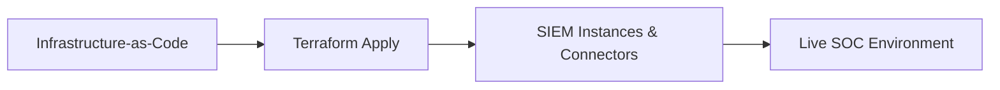

### 11. Metadata Lake for Forensic Audit Readiness
Storing immutable, long-term records of every automated remediation action and investigation.

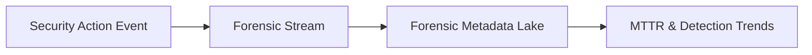

---

## 🏛️ Core Security Pillars

1.  **High-Velocity Ingestion & Normalization**: Centralized hub for ingesting logs from apps, infra, and network into a unified schema.
2.  **Rule-Based Correlation Engine**: Advanced logic for detecting patterns (bruteforce, lateral movement) across disparate sources.
3.  **SOAR Playbook Orchestration**: Automated response workflows that execute containment actions without manual intervention.
4.  **Intelligent Alert Prioritization**: Severity-based scoring and deduplication to ensure the SOC focuses on critical threats.
5.  **Unified Case Management**: Full-lifecycle tracking of security incidents—from initial alert to forensic closure.
6.  **Immutable Response Audit**: Comprehensive logging of every automated and manual action for transparency.

---

## 🛠️ Technical Stack & Implementation

### SIEM/SOAR Engine & APIs
*   **Framework**: Python 3.11+ / FastAPI.
*   **Ingestion Engine**: Schema-based normalization for multi-source security events.
*   **Correlation Engine**: Rule-based pattern matching for cross-source threat detection.
*   **Playbook Engine**: Workflow orchestrator for automated response actions.
*   **State Management**: PostgreSQL (Metadata) and Redis (Event Queue).

### Security Command Dashboard (UI)
*   **Framework**: React 18 / Vite.
*   **Theme**: Rose / Slate (Modern Security Operations & SOC aesthetic).
*   **Visualization**: Recharts for alert velocity trendlines and threat distribution heatmaps.

### Infrastructure & DevOps
*   **Runtime**: AWS EKS or Azure Kubernetes Service (AKS).
*   **IaC**: Modular Terraform for deploying the detection clusters and SOAR workers.

---

## 🏗️ IaC Mapping (Module Structure)

| Module | Purpose | Real Services |
| :--- | :--- | :--- |
| **`infrastructure/siem`** | Detection plane and rule registry | EKS, Sentinel, Splunk, Elastic |
| **`infrastructure/soar`** | Automation and playbook workers | Lambda, Step Functions, Demisto |
| **`infrastructure/ingestion`** | Log collectors and forwarders | Logstash, Fluentd, Kinesis |
| **`infrastructure/case-management`** | Incident and evidence tracking | PostgreSQL, S3, ServiceNow |

---

## 🚀 Deployment Guide

### Local Principal Environment
```bash
# Clone the security platform
git clone https://github.com/devopstrio/siem-soar-integration.git
cd siem-soar-integration

# Configure environment
cp .env.example .env

# Launch the Security stack
make up

# Simulate a security event ingestion
make ingest-events

# Run threat detection & correlation
make detect-threats
```

Access the Security Command Dashboard at `http://localhost:3000`.

---

## 📜 License
Distributed under the MIT License. See `LICENSE` for more information.

---
<div align="center">
  <p>© 2026 Devopstrio. All rights reserved.</p>
</div>
